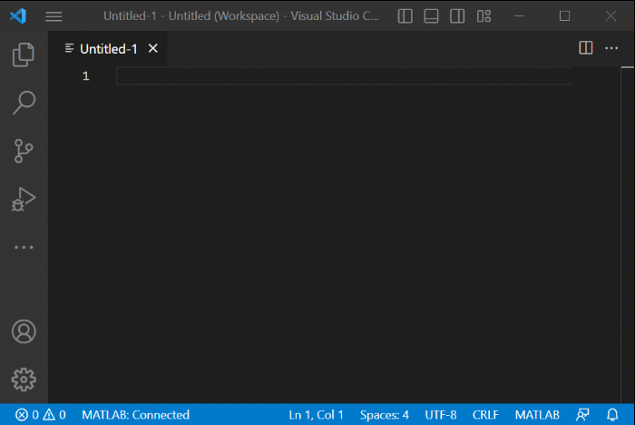
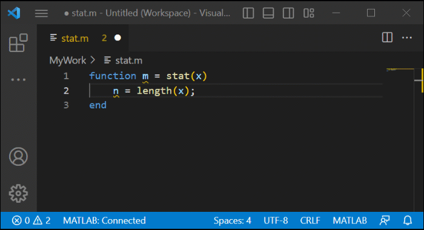

# MATLAB extension for Visual Studio Code
This extension provides support for editing MATLAB code in VS Code and includes features such as syntax highlighting, code analysis, navigation support, and more.

## Installation
You can install the extension from within VS Code or download it from the marketplace. After installing the extension, you might need to configure it to make full use of all the features

### Set MATLAB Install Path
If you have MATLAB installed on your system, the extension automatically checks the system path for the location of the MATLAB executable. If the MATLAB executable is not on the system path, you may need to set the MATLAB install path manually.
To manually set the MATLAB install path, set the matlab.installPath setting to the full path of your MATLAB installation. You can determine the full path to your MATLAB installation using the matlabroot command in MATLAB. 

For example:

Run the `matlabroot` command in the MATLAB Command Window:
```
matlabroot
ans =
    'C:\Program Files\MATLAB\R2022b'

```
Set the matlab.installPath setting to the value returned by the matlabroot command
```
matlab.installPath = C:\Program Files\MATLAB\R2022b
```

### Disable/Enable MATLAB Index Workspace
By default, the extension indexes all the MATLAB code files in your current workspace. Indexing allows the extension to find and navigate between your MATLAB code files. 
You can disable indexing to improve the performance of the extension. To disable indexing, set the matlab.indexWorkspace setting to false. Disabling indexing can cause features such as code navigation to not function as expected.

### Change MATLAB Connection Timing
By default, the extension starts MATLAB in the background when you open a MATLAB code file in VS Code. To change when the extension starts MATLAB, change the value of the matlab.matlabConnectionTiming setting. Options include
* **onStart** (default) - Start MATLAB as soon as the extension is launched.
* **onDemand** - Start MATLAB only when needed
* **never** - Never start MATLAB


## Getting Started
To get started using the extension, open any MATLAB code file or create a new file and set the language to MATLAB. By default, you have access to a basic set of features. If you have MATLAB installed on your system, you also have access to an additional set of advanced code editing features.


### Basic features (no MATLAB required)
The extension provides several basic features, regardless of whether you have MATLAB installed on your system. These features include:
* Syntax highlighting
* Code snippets
* Commenting
* Code Folding



### Advanced features (requires MATLAB installed on your system)
* Automatic code completions
* Document formatting
* Code navigation
* Code analysis such as continuous code checking and automatic fixes.



## Troubleshooting
If the MATLAB installation path is not properly configured, you will see an error when you try to use certain advanced features such as document formatting and code navigation.


To resolve the error, set the MATLAB installation path to the location of the MATLAB executable. For more information, see the **Installation > Set MATLAB Install Path** section above.

## Telemetry
The MATLAB extension collects anonymous user experience information and sends it to MathWorks to help product and features improvement. For more information, see the MathWorks Privacy Policy. You can opt in or out of this service using the matlab.telemetry.enabled setting.

## Feedback
We encourage all feedback. If you encounter a technical issue or have an enhancement request, create an issue here or send an email to vscode-support@mathworks.com.

## Release Notes

### 1.0.0

Initial release of MATLAB extension for Visual Studio Code